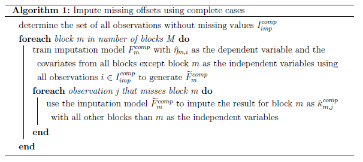
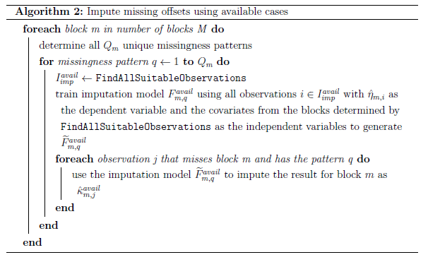
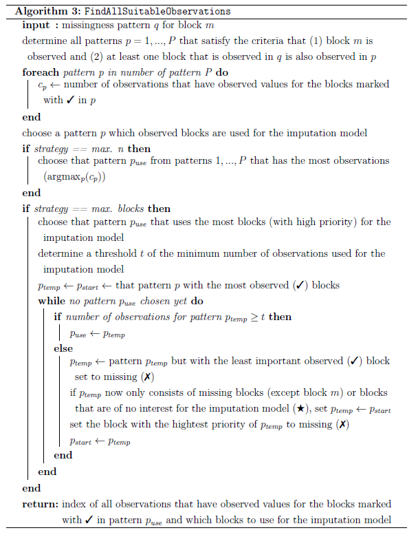

```{r, include = FALSE}
knitr::opts_chunk$set(
  collapse = TRUE,
  comment = "#>"
)
```

There are several ways how `prioritylasso` can handle blockwise missing data. The options can be passed to the `mcontrol` argument via the `missing.control()` function.

# priority-Lasso-ignore

The basic idea of this approach is that the Lasso model for every block is only fitted with the observations that have no missing values for this block. In this way, no data has to be imputed and all the available data is used. However, for observations with the current block missing, no offset for the next block can be calculated. To circumvent this problem, for these observations the offset (including the intercept) from the previous block is carried forward. If observations lack the values for the first block, the offset for the second block is either set to 0 or to the estimated intercept of the first block (pL-ign (zero/intercept)). In the following, a formal notation is provided.

Let the offset of a block $m$ for an observation $i$ be denoted as $\delta_{m, i}$, defined as

```{=latex}
\begin{align}
    \delta_{1, i} &= 0\nonumber \\
    \delta_{2, i} &=
    \begin{cases}
    \hat{\eta}_{1, i}, & \text{if}\ x^{(1)}_{i1}, ..., x^{(1)}_{ip_{1}}\ \text{are not missing}\\
    0\ \text{or}\ \hat{\beta}^{(1)}_0, & \text{if}\ x^{(1)}_{i1}, ..., x^{(1)}_{ip_{1}}\ \text{are missing}
    \end{cases}\\
    \delta_{m, i}&=
    \begin{cases}
    \hat{\eta}_{m-1, i}, & \text{if}\ x^{(m-1)}_{i1}, ..., x^{(m-1)}_{ip_{m-1}}\ \text{are not missing}\\
    \delta_{m-1, i}, & \text{if}\ x^{(m-1)}_{i1}, ..., x^{(m-1)}_{ip_{m-1}}\ \text{are missing}
    \end{cases}
    \hspace{0.5cm}
    m = 3, ..., M\nonumber \\
    \forall i,\nonumber
\end{align}
```
where $\hat{\eta}_{m, i}$ is the prediction from block $m$ for the $i$th observation.

# priority-Lasso-impute

As in the previous approach, in the second approach the Lasso models fitted to the separate blocks only use the available data and no covariates are imputed. However, the offset for the observations with missing values is not carried forward from the previous block, but imputed. This has the advantage that instead of imputing a possibly very high number of covariates, only one value is imputed. The idea for this approach comes from @Hieke2016 where also only an offset is imputed. In this paper, they only use three blocks and have therefore a fixed setting which blocks are used for the imputation model. In the following, a generalised approach with two different strategies about which blocks are used is described. Either all other blocks are used (pL-imp (complete)), which is detailed in section \@ref(complete-cases), or it is tried to use as much information as possible for more complex missingness patterns (pL-imp (available)). This approach is described in section \@ref(available-cases). In general, any model that can predict a continuous outcome can be used as the imputation model. In the following sections, this is represented by only referencing a general regression model $F(\cdot)$. As priority-Lasso is a Lasso based method, for the imputation model a Lasso model is used as well.

## Complete cases {#complete-cases}

The first approach uses all other blocks than the current one to impute the offset derived from the current block. This requires that the data set contains some observations that have no missing values (complete cases). One has to decide on a sensible lower threshold for the number of complete cases. Based on @Hieke2016 that used 26 complete cases, the default is set to 30 cases. Another restriction of this approach is that in every observation with missing data, at most one block can be missing (because all other blocks are used in the imputation model). In the following, a more formal notation is provided.

If only the complete cases are used for the imputation model and $I = \{1, ..., n\}$ is the set of observation indices, the observations used for the imputation model are defined as

```{=latex}
\begin{equation}
    I_{imp}^{comp}=\{i\in I \mid x^{(m)}_{i1}, ..., x^{(m)}_{ip_{m}}\ \text{are not missing}\ \forall m\},
\end{equation}
```
where $x^{(m)}_{i1}, ..., x^{(m)}_{ip_{m}}$ are the covariates of the $m$th block of the $i$th observation. Let $F(\cdot)$ be a general regression model that can be trained by providing the dependent variable and the independent variables. Then $\widetilde{F}(\cdot)$ is a trained regression model that returns its prediction when provided with the independent variables.

The below algorithm describes how for an observation $j$ that misses block $m$ the linear predictor is imputed as $\hat{\kappa}_{m, j}^{comp}$.

```{r, complete-cases, fig.cap = "Algorithm 1", echo = FALSE}

```

Subsequently, the offset for a given observation $i$ in block $m$ is given as

```{=latex}
\begin{align}
    \delta_{1, i} &= 0\nonumber \\
    \delta_{m, i}&=
    \begin{cases}
    \hat{\eta}_{m-1, i}, & \text{if}\ x^{(m-1)}_{i1}, ..., x^{(m-1)}_{ip_{m-1}}\ \text{are not missing}\\
    \hat{\kappa}_{m-1, i}^{comp}, & \text{if}\ x^{(m-1)}_{i1}, ..., x^{(m-1)}_{ip_{m-1}}\ \text{are missing}
    \end{cases}
    \hspace{0.5cm}
    m = 2, ..., M \\
    &\forall i\hspace{0.2cm} s.t. \hspace{0.2cm}\text{every observation $i$ misses at most $1$ block $m$.}\nonumber
\end{align}
```
## Available cases {#available-cases}

The previous approach always uses all other blocks to impute the offset for a missing block. However, often data sets do not contain observations with complete cases or observations lack more than only one block. For these cases a more flexible approach was developed. It divides the observations into different subsets. All observations that miss block $m$ are grouped by their missingness pattern. A missingness pattern describes which combination of blocks are missing for a given observation. Then, for every unique pattern an imputation model is fitted. An overview about this approach is given in algorithm \@ref(fig:available-cases).

First, for all observations that miss block $m$ all unique missingness patterns $Q_m$ are determined. A missingness pattern $q$ is defined as the information for every block if its values are observed (`r knitr::asis_output("\U02713")`) or missing (`r knitr::asis_output("\U02717")`). For a model that uses 3 blocks, observations that miss block 1 can have the following missingness patterns: {`r knitr::asis_output("\U02717")`, `r knitr::asis_output("\U02713")`, `r knitr::asis_output("\U02713")`}, {`r knitr::asis_output("\U02717")`, `r knitr::asis_output("\U02717")`, `r knitr::asis_output("\U02713")`}, {`r knitr::asis_output("\U02717")`, `r knitr::asis_output("\U02713")`, `r knitr::asis_output("\U02717")`}. Not all patterns need to be observed in the training data.

In the next step, for every missingness pattern $q$ all observations that can be used for the imputation model are found by \texttt{FindAllSuitableObservations} and the indices of these observations are stored in $I_{imp}^{avail}$. This step is explained in detail later on. Similar to the algorithm using the complete cases, these observations are used to generate the trained imputation model $\widetilde{F}_{m, q}^{avail}$ which in turn is used to impute the linear predictor of block $m$ for every observation $j$ that misses this block. This imputation is denoted as $\hat{\kappa}_{m, j}^{avail}$.

\texttt{FindAllSuitableObservations} searches for observations from the training data that can be used for an imputation model for observations that miss block $m$ and have the specific missingness pattern $q$. Possible observations have to fulfill two criteria: (1) block $m$ has to be observed and (2) at least one other block that is observed in the pattern $q$ has to be observed. For example, for $m = 1$ and $q=\{\text{`r knitr::asis_output("\U02717")`, `r knitr::asis_output("\U02713")`, `r knitr::asis_output("\U02713")`, `r knitr::asis_output("\U02717")`}\}$ observations with the pattern \{`r knitr::asis_output("\U02713")`, `r knitr::asis_output("\U02717")`, `r knitr::asis_output("\U02717")`, `r knitr::asis_output("\U02713")`\} are not considered, as block 4 is not observed by observations with the pattern $q$ and therefore cannot be used in an imputation model.

The pseudocode is given in algorithm \@ref(fig:findallsuitableobservations). For a given missingness pattern $q$ for block $m$, \texttt{FindAllSuitableObservations} generates all possible patterns $P$ that satisfy the above mentioned criteria. In the example, these are \{`r knitr::asis_output("\U02713")`, `r knitr::asis_output("\U02713")`, `r knitr::asis_output("\U02713")`, `r knitr::asis_output("\U02732")`\}, \{`r knitr::asis_output("\U02713")`, `r knitr::asis_output("\U02713")`, `r knitr::asis_output("\U02717")`, `r knitr::asis_output("\U02732")`\} and \{`r knitr::asis_output("\U02713")`, `r knitr::asis_output("\U02717")`, `r knitr::asis_output("\U02713")`, `r knitr::asis_output("\U02732")`\}, where `r knitr::asis_output("\U02732")` denotes that the block can be either observed or missing. Blocks denoted with `r knitr::asis_output("\U02732")` are not of interest because they cannot be used for the imputation model. Then, for every pattern $p = 1, ..., P$ it is counted how many observations have observed values for all blocks marked with `r knitr::asis_output("\U02713")`e in the pattern $p$ (and therefore can be used for an imputation model using these blocks).

Afterwards, one pattern $p$ is chosen for the imputation model. For this, two strategies exist. Strategy \textit{max. observations} or \textit{max. n} chooses the pattern that has the most observations that can be used for the imputation model (pL-imp (available, max. n)). Strategy \textit{maximise blocks} or \textit{max. blocks} chooses the pattern that uses the most high priority blocks (pL-imp (available, max. blocks)). The pattern is determined as follows: If the pattern with the most observed (`r knitr::asis_output("\U02713")`) blocks (the start pattern $p_{start}$) has more or equal observations than a threshold (the default is 30), this pattern is used. If this is not the case, the observed block with the lowest priority is set to missing (`r knitr::asis_output("\U02717")`) and this new pattern is considered and so on. If the new pattern only consists of missing blocks except block $m$, then the start pattern is again considered but now with the observed block with the highest priority set to missing and the procedure is repeated.

Let us consider the missingness pattern $q = \{\text{`r knitr::asis_output("\U02717")`, `r knitr::asis_output("\U02713")`, `r knitr::asis_output("\U02713")`, `r knitr::asis_output("\U02713")`}\}$ for block $m=1$ as an example. Then, the patterns $P$ for the imputation model are checked in the following order for strategy \textit{max.blocks}: \{`r knitr::asis_output("\U02713")`, `r knitr::asis_output("\U02713")`, `r knitr::asis_output("\U02713")`, `r knitr::asis_output("\U02713")`\}, \{`r knitr::asis_output("\U02713")`, `r knitr::asis_output("\U02713")`, `r knitr::asis_output("\U02713")`, `r knitr::asis_output("\U02717")`\}, \{`r knitr::asis_output("\U02713")`, `r knitr::asis_output("\U02713")`, `r knitr::asis_output("\U02717")`, `r knitr::asis_output("\U02717")`\},
\{`r knitr::asis_output("\U02713")`, `r knitr::asis_output("\U02717")`, `r knitr::asis_output("\U02713")`, `r knitr::asis_output("\U02713")`\}, \{`r knitr::asis_output("\U02713")`, `r knitr::asis_output("\U02717")`, `r knitr::asis_output("\U02713")`, `r knitr::asis_output("\U02717")`\} and \{`r knitr::asis_output("\U02713")`, `r knitr::asis_output("\U02717")`, `r knitr::asis_output("\U02717")`, `r knitr::asis_output("\U02713")`\}.

```{r, available-cases, fig.cap = "Algorithm 2", echo = FALSE}

```

```{r, findallsuitableobservations, fig.cap = "Algorithm 3", echo = FALSE}

```

Subsequently, the offset for a given observation $i$ in block $m$ is given as
```{=latex}
\begin{align}
    \delta_{1, i} &= 0\nonumber \\
    \delta_{m, i}&=
    \begin{cases}
    \hat{\eta}_{m-1, i}, & \text{if}\ x^{(m-1)}_{i1}, ..., x^{(m-1)}_{ip_{m-1}}\ \text{are not missing}\\
    \hat{\kappa}_{m-1, i}^{avail}, & \text{if}\ x^{(m-1)}_{i1}, ..., x^{(m-1)}_{ip_{m-1}}\ \text{are missing}
    \end{cases}
    \hspace{0.5cm}
    m = 2, ..., M \\
    \forall i.\nonumber
\end{align}
```

# Prediction of new data
Depending on the method how to deal with block-wise missing values that was used with the training data, it differs how priority-Lasso can deal with missing values in new (test) data. If the training data contains block-wise missing values and was fitted with priority-Lasso-ignore, this enables to build a model for the training data, but it does not provide a method to deal with missing data in test data per se. Therefore I enabled the ad hoc solution to set block-wise missing values in the test data to 0. In general, this means that besides the estimated intercept of this block, the information from this block is not included. In the special case that the data is centered before the application of priority-Lasso, it corresponds to mean imputation of the missing values.

If the training data was fitted with priority-Lasso-impute (complete), new observations can have missing values in at most one block.
Irrespective of the actual missingness situation in the training data, the imputation models are always calculated. When there are no observations with missing values in the training data, the imputation models are not needed for the model estimation, but can be used if new test data has block-wise missing values.

When using priority-Lasso-impute (available), in contrast, the missingness patterns of the new observations have to be already included in the training data, otherwise no prediction is possible.

# References

<div id="refs"></div>